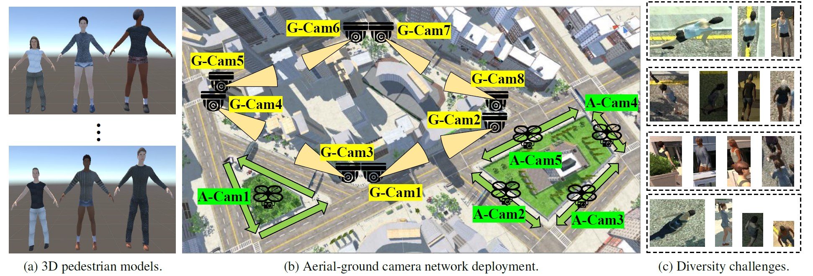
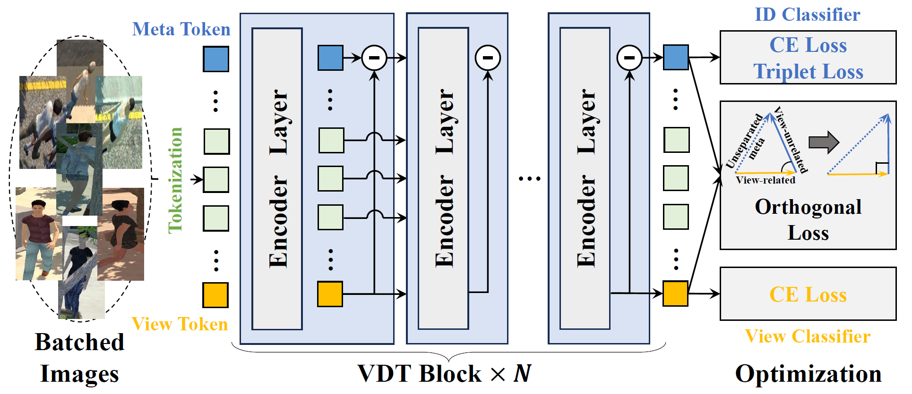

<div align="center">

# SD-ReID: View-aware Stable Diffusion for Aerial-Ground Person Re-Identification

**Official PyTorch implementation of the IEEE Transactions on Image Processing (TIP), 2026 paper**

[Yuhao Wang](https://924973292.github.io/) · [Xiang Hu](https://arxiv.org/search/cs?searchtype=author&query=Hu,+X) · [Lixin Wang](https://arxiv.org/search/cs?searchtype=author&query=Wang,+L) · [Pingping Zhang](https://scholar.google.com/citations?user=MfbIbuEAAAAJ&hl=zh-CN) · [Huchuan Lu](https://scholar.google.com/citations?user=D3nE0agAAAAJ&hl=zh-CN)

[](https://arxiv.org/abs/2504.09549)
[](https://arxiv.org/pdf/2504.09549)
[](https://ieeexplore.ieee.org/xpl/RecentIssue.jsp?punumber=83)
[](https://www.python.org/)
[](https://pytorch.org/)
[](LICENSE)

A generative AG-ReID framework that learns view-aware identity representations with Stable Diffusion guidance.

</div>

## News

- **2026.05**: Codebase cleaned and reproduction guide released for the IEEE TIP 2026 version.
- **2026**: SD-ReID is accepted by **IEEE Transactions on Image Processing (TIP)**.
- **2025.10**: arXiv preview updated to v2: [arXiv:2504.09549](https://arxiv.org/abs/2504.09549).

## Table of Contents

- [Overview](#overview)
- [Visual Overview](#visual-overview)
- [Paper Information](#paper-information)
- [Method](#method)
- [Installation](#installation)
- [Pretrained Assets](#pretrained-assets)
- [Datasets](#datasets)
- [Reproduction](#reproduction)
- [Evaluation](#evaluation)
- [Troubleshooting](#troubleshooting)
- [Citation](#citation)

## Overview

Aerial-Ground Person Re-Identification (AG-ReID) aims to retrieve a target person across cameras with sharply different viewpoints. Existing discriminative models often focus on suppressing viewpoint variations, while the view-specific cues themselves can be useful for building stronger identity representations.

SD-ReID introduces a **view-aware generative ReID framework**. It first trains a ViT-based ReID model to produce person representations and controllable identity/view conditions, then fine-tunes Stable Diffusion to enhance person representations under these conditions. A View-Refined Decoder (VRD) bridges instance-level and global-level features, and the final retrieval uses both person representations and all-view features.

The method is evaluated on five AG-ReID benchmarks: **CARGO**, **AG-ReIDv1**, **AG-ReIDv2**, **LAGPeR**, and **G2APS-ReID**. Please refer to the [paper](https://arxiv.org/pdf/2504.09549) for full quantitative results and analysis.

## Visual Overview

<div align="center">



**CARGO benchmark overview.** The aerial-ground setting contains large viewpoint changes, diverse person appearances, and heterogeneous camera deployments.



**View-aware representation learning.** The Stage-1 model learns identity-related and view-related representations before Stable Diffusion guided refinement.

</div>

## Paper Information

| Item | Details |
| --- | --- |
| Venue | IEEE Transactions on Image Processing (TIP), 2026 |
| Preview | [arXiv:2504.09549](https://arxiv.org/abs/2504.09549), v2 revised on Oct. 30, 2025 |
| Task | Aerial-Ground Person Re-Identification |
| Benchmarks | CARGO, AG-ReIDv1, AG-ReIDv2, LAGPeR, G2APS-ReID |
| Codebase | PyTorch, modular ReID training, Diffusers-based Stable Diffusion modules |

## Method

| Component | Role |
| --- | --- |
| Stage-1 ReID Encoder | Learns identity-discriminative and view-aware person representations. |
| Identity/View Conditions | Provide controllable guidance for Stable Diffusion fine-tuning. |
| Stage-2 SD Module | Refines person features through the Stable Diffusion prior. |
| View-Refined Decoder | Aligns instance-level features with global all-view representations. |
| All-view Retrieval | Combines person and all-view features for final ranking. |

## Installation

```bash
conda create -n sdreid python=3.10 -y
conda activate sdreid

# Install the PyTorch build that matches your CUDA driver.
pip install torch torchvision --index-url https://download.pytorch.org/whl/cu118

# Install the remaining dependencies.
pip install -r requirements.txt
```

Optional Cython acceleration for ranking and ROC evaluation:

```bash
cd fastreid/evaluation/rank_cylib
python setup.py build_ext --inplace
cd ../../..
```

If the Cython extension is unavailable, evaluation falls back to the Python implementation. FAISS is only required when jaccard distance or reranking is enabled.

## Pretrained Assets

Place pretrained models under `pretrained/` by default:

```text
pretrained/
  jx_vit_base_p16_224-80ecf9dd.pth
  stable-diffusion-v1-5/
    vae/
    unet/
    scheduler/
```

| Asset | Expected path | Note |
| --- | --- | --- |
| ViT-Base ImageNet checkpoint | `pretrained/jx_vit_base_p16_224-80ecf9dd.pth` | Used by Stage 1. |
| Stable Diffusion VAE | `pretrained/stable-diffusion-v1-5/vae` | Diffusers format. |
| Stable Diffusion UNet | `pretrained/stable-diffusion-v1-5/unet` | Diffusers format. |
| Stable Diffusion scheduler | `pretrained/stable-diffusion-v1-5/scheduler` | Diffusers format. |

For slow Hugging Face access, download with a mirror such as `hf-mirror.com` or ModelScope and keep the same local folder names.

## Datasets

Set a unified dataset root:

```bash
export FASTREID_DATASETS=/path/to/datasets
```

The same path can be passed at runtime with `DATASETS.ROOT /path/to/datasets`. Dataset files are not included in this repository; please obtain each benchmark according to its license.

<details>
<summary>Expected dataset layout</summary>

```text
$FASTREID_DATASETS/
  AG_ReID_v2/
    train_all/
    query/
    gallery/
    exp1_aerial_to_cctv.txt
    exp2_aerial_to_wearable.txt
    exp4_cctv_to_aerial.txt
    exp5_wearable_to_aerial.txt
    qut_attribute_v8.mat

  AG_ReID_v1/
    bounding_box_train/
    query_all_c0/
    query_all_c3/
    bounding_box_test_all_c0/
    bounding_box_test_all_c3/
    qut_attribute_v4_88_attributes.mat

  G2APS-ReID/
    bounding_box_train/
    exp3_A2G+.txt
    exp4_G2A+.txt

  LAGPeR/
    bounding_box_train/
    exp3_A2G+.txt
    exp4_G2A+.txt
    exp5_G2A+G.txt

  CARGO/
    train/
    query/
    gallery/
```

</details>

## Reproduction

The default seed is fixed to `1111`. Stage 2 loads the matching Stage-1 checkpoint by default.

### Main AG-ReIDv2 Protocol

```bash
python tools/train_net.py --config-file configs/v2/base_stage1.yml --num-gpus 1 \
  DATASETS.ROOT "$FASTREID_DATASETS"

python tools/train_net.py --config-file configs/v2/base_stage2.yml --num-gpus 1 \
  DATASETS.ROOT "$FASTREID_DATASETS" \
  MODEL.WEIGHTS logs/v2/base_stage1_beta/model_best.pth
```

The same two-stage run can be launched with:

```bash
bash run_v2.sh
```

### Experiment Matrix

| Benchmark | Stage 1 | Stage 2 | Script |
| --- | --- | --- | --- |
| AG-ReIDv2 | `configs/v2/base_stage1.yml` | `configs/v2/base_stage2.yml` | `bash run_v2.sh` |
| AG-ReIDv1 | `configs/v1/base_stage1.yml` | `configs/v1/base_stage2.yml` | `bash go/base.sh` |
| G2APS-ReID | `configs/G2APS_ReID/base_stage1.yml` | `configs/G2APS_ReID/base_stage2.yml` | `bash run_G2APS_ReID.sh` |
| G2APS-ReID 128x64 | `configs/G2APS_ReID/base_stage1_128.yml` | `configs/G2APS_ReID/base_stage2_128.yml` | `bash run_G2APS_ReID_128.sh` |
| LAGPeR | `configs/LAGPeR/base_stage1.yml` | `configs/LAGPeR/base_stage2.yml` | `bash run_LAGPeR.sh` |
| CARGO | `configs/CARGO/base_stage1.yml` | `configs/CARGO/base_stage2_step5.yml` | `bash CARGO.sh` |

Useful overrides:

```bash
# Multi-GPU training
CUDA_VISIBLE_DEVICES=0,1 python tools/train_net.py --config-file configs/v2/base_stage1.yml --num-gpus 2

# Change batch size or output directory
python tools/train_net.py --config-file configs/v2/base_stage1.yml \
  SOLVER.IMS_PER_BATCH 128 OUTPUT_DIR logs/v2/custom_stage1
```

## Evaluation

Evaluate a Stage-2 checkpoint:

```bash
python tools/train_net.py --config-file configs/v2/base_stage2.yml --eval-only --num-gpus 1 \
  DATASETS.ROOT "$FASTREID_DATASETS" \
  MODEL.WEIGHTS logs/v2/base_stage2_tstep800/model_best.pth
```

Evaluate a Stage-1 checkpoint:

```bash
python tools/train_net.py --config-file configs/v2/base_stage1.yml --eval-only --num-gpus 1 \
  DATASETS.ROOT "$FASTREID_DATASETS" \
  MODEL.WEIGHTS logs/v2/base_stage1_beta/model_best.pth
```

Before long runs, a lightweight sanity check is recommended:

```bash
python -m compileall fastreid tools
for s in CARGO.sh run_G2APS_ReID.sh run_G2APS_ReID_128.sh run_LAGPeR.sh run_v2.sh go/base.sh; do bash -n "$s"; done
```

## Troubleshooting

| Symptom | Check |
| --- | --- |
| Dataset `FileNotFoundError` | Verify `FASTREID_DATASETS` or `DATASETS.ROOT`, and match the folder names above. |
| Missing ViT checkpoint | Put `jx_vit_base_p16_224-80ecf9dd.pth` under `pretrained/`, or override `MODEL.BACKBONE.PRETRAIN_PATH`. |
| Missing Stable Diffusion files | Ensure `vae`, `unet`, and `scheduler` are Diffusers-format folders. |
| Cython build failure | Install `cython` and a compiler; Python evaluation fallback remains available. |
| FAISS import failure | Install `faiss-cpu` for jaccard distance/reranking, or keep reranking disabled. |
| Out of memory | Reduce `SOLVER.IMS_PER_BATCH`, `TEST.IMS_PER_BATCH`, or `TEST.SDMODEL.NUM_INFERENCE_STEPS`. |

## Repository Notes

Generated artifacts and local assets are intentionally excluded from version control: caches, compiled extensions, datasets, checkpoints, pretrained weights, logs, and experiment outputs.

## Citation

If SD-ReID is helpful for your research, please cite the paper:

```bibtex
@article{wang2026sdreid,
  title   = {SD-ReID: View-aware Stable Diffusion for Aerial-Ground Person Re-Identification},
  author  = {Wang, Yuhao and Hu, Xiang and Wang, Lixin and Zhang, Pingping and Lu, Huchuan},
  journal = {IEEE Transactions on Image Processing},
  year    = {2026}
}
```

For the preview version:

```bibtex
@article{wang2025sdreid,
  title   = {SD-ReID: View-aware Stable Diffusion for Aerial-Ground Person Re-Identification},
  author  = {Wang, Yuhao and Hu, Xiang and Wang, Lixin and Zhang, Pingping and Lu, Huchuan},
  journal = {arXiv preprint arXiv:2504.09549},
  year    = {2025}
}
```

## Contact

Questions and discussions are welcome through GitHub Issues. More projects can be found at [Yuhao Wang's homepage](https://924973292.github.io/).